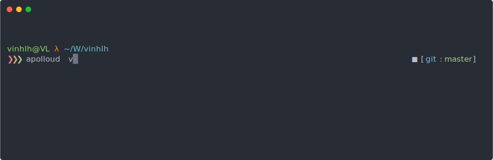

[](https://travis-ci.com/vinhlh/apolloud)

# Apolloud
Shuffle play all SoundCloud tracks liked by an user.

<p align="center">
	<br>
	
	<br>
</p>


## Usage
- Install
```bash
yarn global add apolloud
```

- Run 
```bash
apolloud {userName} {trackType}
```
Example: `apolloud vinhlh`.

Supported track types: `likes`(default), `all` (tracks on All tab).

## Limits

Underneath, we are using `Puppeteer` to launch a Chromium instance.

### Slow installation
Apolloud depends on [Puppeteer](https://github.com/GoogleChrome/puppeteer) which downloads a recent version of Chromium (~170MB Mac, ~280MB Linux, ~280MB Win).

### Slow intialization
It will takes around 10 seconds.

## Contributing
- `yarn dev` to compile automatically.

- Run `yarn start` to run the app whenever you need.
